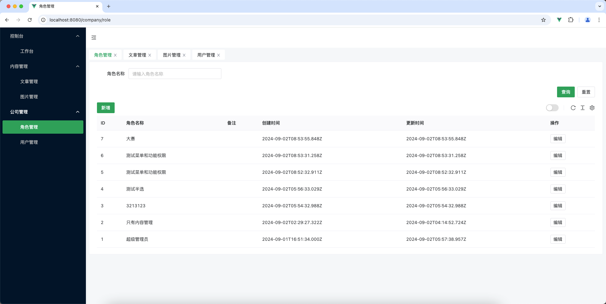

# 简介

使用 nestjs、prisma、vue3、naive-ui 的后台管理系统

# 已完成
- 🔒 登录访问控制
- 📋 列表数据获取
- 📝 接口日志记录
- 🔄 响应和异常统一格式返回
- 👥 角色管理

# TODO

- [ ] 图片管理

- [ ] 文章编辑器使用上传的图片作为资源库

- [ ] crud 一键生成
后台管理想不到什么需求，在dev分支弄一个短视频的功能